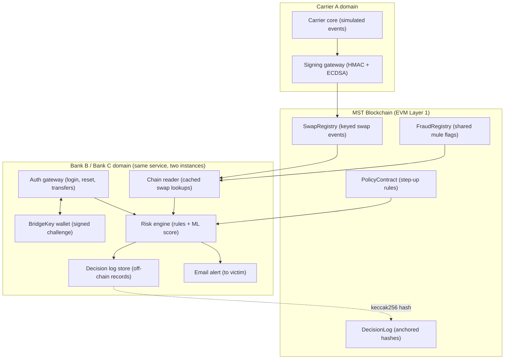

# BlockShield

**Cross-carrier, cross-bank SIM-swap fraud prevention on the [MST Blockchain](https://mstblockchain.com/), with [BridgeKey](https://bridgekey.io/) as the trusted-device signer.**

---

## Architecture Overview



---

## Technology Stack

| Layer | Choice | Notes |
| :--- | :--- | :--- |
| **Blockchain** | **MST Blockchain** (Public EVM L1) | Proof of Staked Authority, ~3s block time |
| **Smart Contracts** | **Solidity (`0.8.20`)** + Foundry | `SwapRegistry`, `FraudRegistry`, `PolicyContract`, `DecisionLog` |
| **Device Signer** | **BridgeKey** Non-Custodial Wallet | Biometric-unlocked on-device key signing (EIP-191) |
| **Backend Services** | **Python (Flask Framework)** | Carrier Gateway, Multi-tenant Bank B / Bank C, Chain Reader, Risk Engine, Decision Log |
| **Frontend Integration** | **React / Web UI** | CORS-enabled REST API for timeline, transfers, risk scoring, and audit verification |
| **Testing** | **Pytest + Foundry** | Automated test suite for all 6 demo fraud scenarios |

---

## Repository Layout

```
.
├── contracts/
│   ├── src/
│   │   ├── SwapRegistry.sol      # Carrier allowlist, HMAC tokens, swap recording
│   │   ├── FraudRegistry.sol     # Consortium shared mule flags
│   │   ├── PolicyContract.sol    # Risk windows & thresholds
│   │   └── DecisionLog.sol       # Off-chain decision hash anchor verification
│   └── foundry.toml              # Foundry config for MST Blockchain
├── backend/
│   ├── app.py                    # Main Flask application with CORS & Blueprints
│   ├── config.py                 # Environment configuration & keys
│   ├── carrier/
│   │   └── carrier_service.py    # HMAC-SHA256 tokenization & swap event signing
│   ├── bank/
│   │   ├── bank_service.py       # Bank B & Bank C auth, transfer, and alert instances
│   │   ├── risk_engine.py        # Multi-factor fraud scoring engine
│   │   └── decision_logger.py    # Canonical JSON serialization & on-chain anchoring
│   ├── wallet/
│   │   └── bridgekey.py          # BridgeKey challenge & EIP-191 signature verifier
│   ├── chain/
│   │   └── mst_client.py         # Web3 connection to MST Blockchain & contract ABIs
│   ├── simulator/
│   │   └── scenarios.py          # Automated scenario runner for all 6 demo cases
│   └── routes/
│       ├── carrier_routes.py     # /api/carrier/*
│       ├── bank_routes.py        # /api/bank/*
│       ├── wallet_routes.py      # /api/wallet/*
│       ├── consortium_routes.py  # /api/consortium/*
│       └── simulator_routes.py   # /api/simulator/*
├── deploy/
│   ├── Dockerfile
│   ├── docker-compose.yml
│   └── .env.example
├── tests/
│   └── test_backend.py           # Comprehensive pytest suite
├── run.py                        # Entrypoint script
└── requirements.txt
```

---

## Getting Started

### 1. Installation

```bash
# Clone the repository
git clone https://github.com/sksamya/blockshield.git
cd blockshield

# Install Python dependencies
pip install -r requirements.txt
```

### 2. Configuration

Copy the example environment configuration:
```bash
cp .env.example .env
```

### 3. Run the Backend

```bash
python run.py
```
The Flask server will start on `http://localhost:5000`.

### 4. Run the Tests

```bash
python -m pytest tests/test_backend.py -v
```

---

## Demo Scenarios

The simulator includes automated execution for all key consortium fraud scenarios:

1. **Fraud Swap**: Attacker swaps victim SIM at Carrier A, attempts password reset & high-value transfer at Bank B and Bank C. Both banks refuse SMS OTP, block or step-up, alert the victim, and anchor decision hashes on MST Blockchain.
2. **Pre-notified Legitimate Swap**: Customer pre-notifies carrier before swap. Lower-risk policy is applied and normal transfer succeeds.
3. **Un-notified Legitimate Swap**: Customer swaps without prior notification. Step-up required; customer signs on-device challenge with **BridgeKey** biometric wallet and succeeds.
4. **Old Swap**: Historical swap outside the 72h risk window. No adverse effect on risk.
5. **Mule Flag Sharing**: Bank B flags a suspicious mule account on MST `FraudRegistry`. Bank C detects the on-chain flag and blocks transfers.
6. **Audit & Tamper Detection**: Recomputes `keccak256(canonical JSON)` off-chain and compares against on-chain anchor on `DecisionLog`, immediately detecting unauthorized alterations.

To trigger scenarios via API:
```bash
# Run all 6 scenarios:
curl -X POST http://localhost:5000/api/simulator/run-all

# Run specific scenario (e.g. Scenario 1):
curl -X POST http://localhost:5000/api/simulator/run/1
```

---

## API Summary

- **Carrier Gateway**: `POST /api/carrier/event`, `POST /api/carrier/pre-notify`, `GET /api/carrier/token`, `GET /api/carrier/events`
- **Bank Gateway**: `POST /api/bank/<bank_id>/transfer`, `POST /api/bank/<bank_id>/password-reset`, `POST /api/bank/<bank_id>/step-up`, `GET /api/bank/<bank_id>/alerts`
- **BridgeKey Signer**: `POST /api/wallet/enroll`, `GET /api/wallet/challenge/<id>`, `POST /api/wallet/verify`, `POST /api/wallet/test-sign`
- **Consortium & Audit**: `POST /api/consortium/mule`, `GET /api/consortium/anchors`, `GET /api/consortium/audit/<bank_id>/<event_ref>`
- **Simulator**: `POST /api/simulator/run-all`, `POST /api/simulator/run/<id>`
