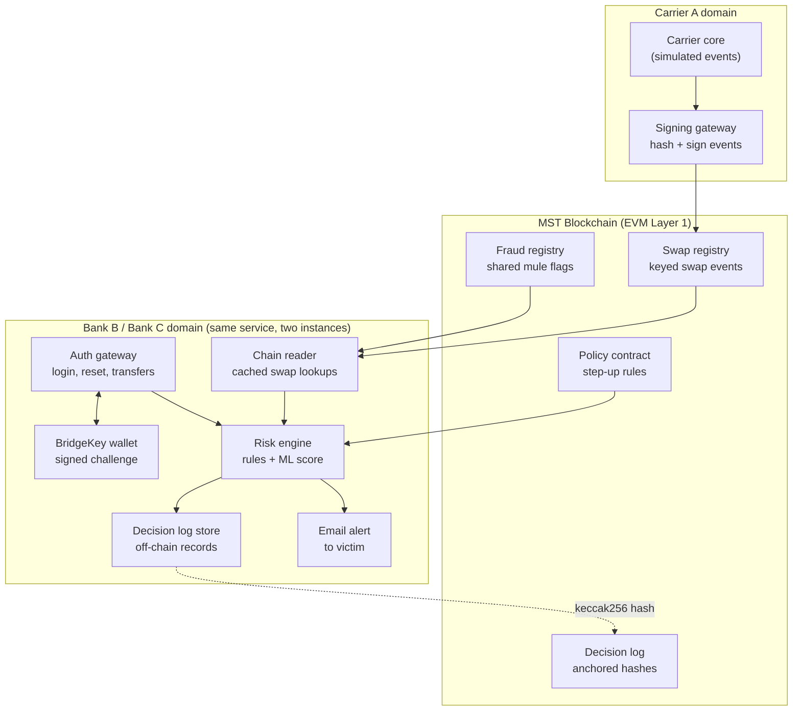

# blockshield

# SIM-Swap Shield

**Cross-carrier, cross-bank SIM-swap fraud prevention on the [MST Blockchain](https://mstblockchain.com/), with [BridgeKey](https://bridgekey.io/) as the trusted-device signer.**

> **Prototype status:** This is a demonstration. Carrier events, device and location signals, and ML risk scores are **simulated**. It is not production software and makes no fraud-detection accuracy claims.

---

## Table of contents

1. [The problem](#the-problem)
2. [How it works](#how-it-works)
3. [Architecture](#architecture)
4. [Technology stack](#technology-stack)
5. [Privacy model](#privacy-model)
6. [Smart contracts](#smart-contracts)
7. [Repository layout](#repository-layout)
8. [Getting started](#getting-started)
9. [Configuration](#configuration)
10. [Demo scenarios](#demo-scenarios)
11. [Testing](#testing)
12. [Implementation roadmap](#implementation-roadmap)
13. [Known limitations and open questions](#known-limitations-and-open-questions)
14. [Contributing](#contributing)
15. [License](#license)

---

## The problem

In a SIM-swap attack, a fraudster moves a victim's phone number to a SIM they control. They then intercept SMS one-time passwords (OTPs), reset the victim's banking password, and move money. Each bank sees only its own slice of the attack, and the carrier's knowledge of the swap normally never reaches the bank.

## How it works

1. **The swap is recorded.** A fraudster swaps a victim's SIM at **Carrier A**. Carrier A signs the event and records it on the MST Blockchain. Only a carrier-keyed token and event metadata are shared. Raw phone numbers and customer data stay with the carrier.
2. **Bank B detects it.** Minutes later the fraudster tries a password reset and a high-value transfer at **Bank B**. Bank B's risk engine combines the recent swap with a new device, an unusual location, password-reset activity and the transfer amount. The score is high.
3. **Bank C detects it too.** The fraudster then targets **Bank C**. Bank C reads the same on-chain swap event and assesses the transaction independently.
4. **SMS OTP is refused.** Both banks refuse SMS OTP and require a **trusted-device signature from BridgeKey** or additional identity verification.
5. **The attack fails.** The fraudster cannot produce the signature, the transfers are blocked, and the victim receives alerts from each affected bank.
6. **Decisions are auditable.** Each bank stores its own risk signals, decision and outcome off-chain. A hash of each decision record is anchored on-chain, giving an auditable record of how different organizations responded to the same event.

### Legitimate SIM changes

- **Pre-notified:** the customer authenticates with their carrier before swapping. The carrier records an authorized SIM-change request, so participating banks treat the swap as *pre-notified* and apply a lower-risk policy.
- **Not pre-notified:** a recent, un-notified swap triggers step-up verification. Legitimate customers recover through approved channels such as in-branch or video verification.

---

## Architecture



The bank stack is built once and deployed twice (Bank B and Bank C), each with its own configuration, database and identity. This demonstrates the cross-bank behavior with little extra work.

---

## Technology stack

| Layer | Choice | Notes |
|---|---|---|
| Blockchain | **MST Blockchain** (public, EVM-compatible L1, Proof of Staked Authority) | Primary target: MST testnet. Explorer: [testnet.mstscan.com](https://testnet.mstscan.com/) |
| Local dev chain | Anvil (Foundry) or Hyperledger Besu | For fast tests and CI without network access |
| Smart contracts | Solidity + Foundry | MST is EVM-compatible, so standard tooling applies |
| Device signer | **BridgeKey** non-custodial wallet (Android app, Chrome extension) | Signs bank challenges with an on-device key, unlocked by biometrics |
| Fallback signer | WebCrypto / ethers.js test wallet | Used in CI and when no device is available |
| Services | TypeScript (Node.js) *or* Python (FastAPI) | Pick one for all services |
| Cache | Redis or SQLite | Fast chain-reader lookups |
| Mail capture | MailHog | Captures victim alerts locally |
| Dashboard | Web UI | Timeline, per-bank decisions, chain view, audit check |

### About MST Blockchain

Per the [MST Blockchain site](https://mstblockchain.com/), MST is a public, EVM-compatible Layer 1 built by Masterstroke Technosoft. It uses Proof of Staked Authority (PoSA), and publishes a ~3-second average block time and ~0.001 MSTC average transaction fees. Standard Ethereum tooling (Hardhat, Remix, MetaMask) is stated to work with little or no change. These figures are vendor claims. Measure them yourself on testnet before relying on them.

### About BridgeKey

Per the [BridgeKey site](https://bridgekey.io/), BridgeKey is a non-custodial wallet for MST and 95+ other EVM chains, with biometric unlock. It is available as an Android app and a Chrome extension. Private keys stay on the user's device. Because the wallet is non-custodial and requires no KYC of its own, **the bank performs identity verification at enrollment** and binds the user's wallet address to their bank account. See [Trusted-device flow](#trusted-device-flow).

> **Integration assumption:** this project uses standard EVM message signing (EIP-191 `personal_sign` or EIP-712 typed data), which is common to EVM wallets. Confirm BridgeKey's exact signing and connection methods (in-app deep link, WalletConnect, or browser-extension provider) with the BridgeKey team before building the mobile flow. The Chrome extension is the simplest path for a first working demo.

---

## Privacy model

**MST is a public chain.** Anyone can read what is written to it, so the privacy model does not rely on chain permissioning.

- **Nothing personal goes on-chain.** Only a keyed token, event type, timestamps, a pre-notification flag, and signatures are written.
- **Keyed token, not a plain hash.** Phone numbers have low entropy, so a plain hash is easy to brute-force. The token is `HMAC-SHA256(carrier_key, E.164 number)`. Banks receive the per-carrier lookup key through a consortium key registry, which is acceptable because banks already hold their customers' numbers. Outsiders see only opaque tokens.
- **Permissioning happens in the contracts.** Only allowlisted carrier addresses can write swap events and only allowlisted bank addresses can write flags and decision anchors.
- **Metadata still leaks.** Timing, event frequency and per-token history are visible to everyone. Rotate keys on a schedule and evaluate per-epoch tokens or private set intersection for production.
- **Decision records stay off-chain.** Only `keccak256(canonical JSON)` is anchored.
- **No PII in the wallet flow.** The wallet signs a nonce and returns a signature. The bank holds the address-to-customer binding.

> For production, consider a permissioned MST deployment or a private channel. Check with the MST team whether that is offered.

---

## Smart contracts

| Contract | Purpose |
|---|---|
| `SwapRegistry` | Carrier allowlist and public keys. `recordEvent()` verifies the carrier signature and rejects replayed nonces. Stores pre-notification entries with an expiry. Emits `SwapRecorded(token, carrier, ts, preNotified)`. |
| `FraudRegistry` | Banks flag mule accounts using a keyed identifier, reporter, evidence hash and timestamp. Other banks can query flags. |
| `PolicyContract` | Governance-set parameters: recent-swap window (e.g. 72h), pre-notified window, step-up thresholds, whether SMS OTP is allowed after a swap. Risk engines read these values. |
| `DecisionLog` | `anchor(bankId, eventRef, decisionHash, ts)`. Only registered banks can write. |

**Swap event schema** (canonical JSON, sorted keys, so hashes are reproducible):

```json
{
  "token": "0x...",
  "carrier_id": "carrier-a",
  "event_type": "SIM_SWAP | ESIM | PORT_OUT",
  "timestamp": 1790000000,
  "pre_notified": false,
  "notification_ref": "optional",
  "nonce": "0x...",
  "signature": "0x..."
}
```

Roles (carrier, bank, governance) use separate addresses. In the prototype, governance is a multisig or a simple consortium vote.

---

## Repository layout

```
.
├── contracts/     Solidity contracts and Foundry tests
├── carrier/       Simulated carrier core, signing gateway, pre-notification API
├── bank/          Auth gateway, risk engine, chain reader, alerts, decision log
├── wallet/        BridgeKey integration and fallback test signer
├── simulator/     Scenario runner (scripted timelines)
├── dashboard/     Live timeline, per-bank panels, chain view, audit page
├── deploy/        Docker Compose, deployment scripts, example configs
└── docs/          Architecture, threat model, demo script
```

---

## Getting started

### Prerequisites

- Node.js 20+ (or Python 3.11+, depending on the service language you choose)
- [Foundry](https://book.getfoundry.sh/)
- Docker and Docker Compose
- A BridgeKey install ([Android](https://play.google.com/store/apps/details?id=com.bridgekey) or [Chrome extension](https://chromewebstore.google.com/detail/bridgekey/bfjojdcfenehemjgjlepdjomkpginlkg)) for the real-device demo
- MST testnet funds for the deployer and each service account. Follow the MST testnet documentation at [mstblockchain.com](https://mstblockchain.com/).

### Quick start (local chain, no wallet needed)

```bash
git clone <your-repo-url> sim-swap-shield
cd sim-swap-shield
cp deploy/.env.example deploy/.env

docker compose -f deploy/docker-compose.yml up -d   # local chain, Redis, MailHog
forge test --root contracts                          # run contract tests
./deploy/scripts/deploy-local.sh                     # deploy contracts locally
./simulator/run.sh fraud-swap                        # run the main scenario
```

Then open the dashboard at `http://localhost:3000` and MailHog at `http://localhost:8025`.

### Run against MST testnet

1. Fill in `deploy/.env` (see [Configuration](#configuration)).
2. Fund the deployer and service accounts with testnet MSTC.
3. Deploy: `./deploy/scripts/deploy-mst-testnet.sh`
4. Start the services: `docker compose -f deploy/docker-compose.yml --profile mst up -d`
5. Run a scenario: `./simulator/run.sh fraud-swap`

### Trusted-device flow

1. **Enroll.** The customer verifies their identity with the bank, connects BridgeKey, and signs an enrollment message. The bank stores `customer_id -> wallet address`.
2. **Challenge.** When the risk engine returns `STEP_UP`, the bank issues a single-use nonce with a short expiry.
3. **Sign.** The customer approves in BridgeKey, unlocked by biometrics, and the wallet signs the challenge.
4. **Verify.** The bank recovers the signer address and compares it with the enrolled address. On success the action proceeds; otherwise it is denied.

---

## Configuration

`deploy/.env.example`:

```bash
# Chain
CHAIN_MODE=local                 # local | mst-testnet
RPC_URL=                         # MST testnet RPC URL (from MST docs)
CHAIN_ID=                        # from MST docs
EXPLORER_URL=https://testnet.mstscan.com
CONFIRMATIONS=2                  # wait before caching an event; tune to MST finality

# Contracts (filled in by deploy scripts)
SWAP_REGISTRY_ADDRESS=
FRAUD_REGISTRY_ADDRESS=
POLICY_CONTRACT_ADDRESS=
DECISION_LOG_ADDRESS=

# Keys (prototype only; use a KMS in production)
CARRIER_A_SIGNING_KEY=
CARRIER_A_TOKEN_KEY=
BANK_ID=bank-b                   # bank-b | bank-c
BANK_SIGNER_KEY=

# Services
REDIS_URL=redis://localhost:6379
SMTP_HOST=localhost
SMTP_PORT=1025
SIGNER_MODE=bridgekey            # bridgekey | test-wallet
```

**Never commit real keys.** `.env` is git-ignored.

---

## Demo scenarios

| # | Scenario | Expected result |
|---|---|---|
| 1 | **Fraud swap.** Fraudster swaps SIM, then attacks Bank B and Bank C. | Both banks refuse SMS OTP, block the transfers, alert the victim and anchor decision hashes. |
| 2 | **Pre-notified legitimate swap.** Customer notifies the carrier first. | Lower-risk policy applies and a normal transfer succeeds. |
| 3 | **Un-notified legitimate swap.** Customer swaps without notice. | Step-up is required. The customer signs with BridgeKey and succeeds, or uses branch or video recovery. |
| 4 | **Old swap.** Swap falls outside the recent-swap window. | No effect on risk. |
| 5 | **Mule flag sharing.** Bank B flags a mule account. | Bank C raises risk on transfers to that account. |
| 6 | **Audit.** A stored decision record is tampered with. | Recomputed hash does not match the on-chain anchor. |

---

## Testing

- **Contracts:** signature validation, replay protection, access control and gas (`forge test`).
- **End-to-end:** every scenario above, run against the local chain in CI.
- **Negative tests:** forged carrier signature, replayed event, unregistered bank writing to `DecisionLog`, tampered decision record, expired or reused wallet challenge.
- **Performance targets:** chain event to bank cache within a few seconds, and risk decision under 200 ms. Measure these on MST testnet, not just locally.

---

## Implementation roadmap

| Phase | Weeks | Focus |
|---|---|---|
| 0 | 1 | Monorepo, Docker Compose, shared schemas, canonical serialization |
| 1 | 1–2 | Contracts and Foundry tests; first deploy to MST testnet |
| 2 | 2 | Carrier simulator, signing gateway, pre-notification API |
| 3 | 3–4 | Bank stack: chain reader, auth gateway, risk engine, alerts, recovery, decision log |
| 4 | 4–5 | BridgeKey trusted-device integration (Chrome extension first, then Android) |
| 5 | 5 | Scenario runner and dashboard |
| 6 | 6 | End-to-end and negative tests, latency measurement, docs and demo recording |

---

## Known limitations and open questions

- **Public chain.** MST is public, so metadata is visible. See [Privacy model](#privacy-model).
- **Finality.** With a ~3s block time, choose a confirmation count and measure it. If a swap is not cached when a transfer arrives, the bank should **fail closed** (step-up) for high-value actions.
- **Which carrier key?** The prototype tries all registered carrier keys. Production should use a number-portability lookup.
- **BridgeKey integration details.** Signing method, deep-link or WalletConnect support and any SDK need confirming with the BridgeKey team.
- **Wallet protection.** A fraudster with both the SIM and the phone is only stopped by the wallet's own biometric or PIN protection.
- **Governance.** Who can change `PolicyContract` parameters needs a real answer beyond the prototype multisig.
- **Simulated data.** Carrier events, device and location signals, and ML scores are synthetic. Label them as such in any demo.
- **Vendor figures.** Performance and network numbers for MST and BridgeKey come from their public websites and have not been independently verified here.

---

## Contributing

1. Fork the repo and create a feature branch.
2. Add tests for any contract or risk-rule change.
3. Run `forge test` and the end-to-end suite before opening a pull request.

## License

Choose a license before publishing (for example MIT or Apache-2.0) and add a `LICENSE` file.
